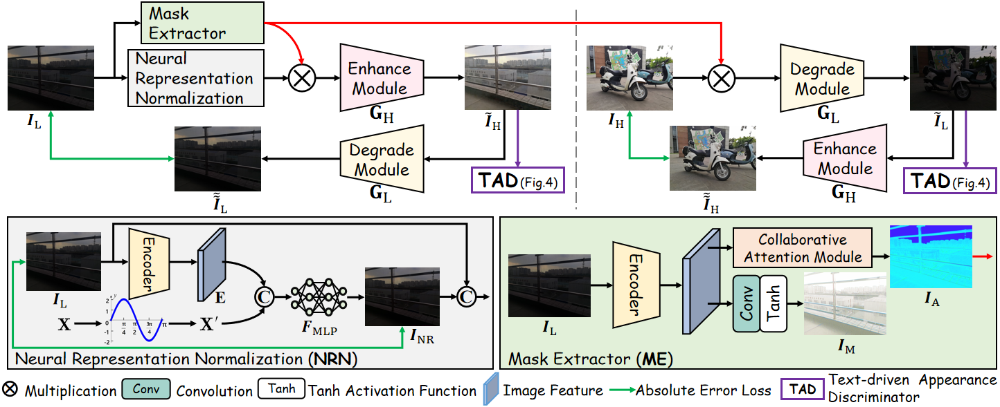

<div align="center">

# 【ICCV'2023🔥】Implicit Neural Representation for Cooperative Low-light Image Enhancement
[](https://iccv2023.thecvf.com/)
[](https://openaccess.thecvf.com/content/ICCV2023/html/Yang_Implicit_Neural_Representation_for_Cooperative_Low-light_Image_Enhancement_ICCV_2023_paper.html)
</div>

Welcome! This is the official implementation of our paper: [**Implicit Neural Representation for Cooperative Low-light Image Enhancement**](https://openaccess.thecvf.com/content/ICCV2023/html/Yang_Implicit_Neural_Representation_for_Cooperative_Low-light_Image_Enhancement_ICCV_2023_paper.html)

Authors: [Shuzhou Yang](https://ysz2022.github.io/), [Moxuan Ding](https://github.com/Dicardo), [Yanmin Wu](https://scholar.google.com/citations?user=11sQNWwAAAAJ&hl=zh-CN&oi=ao), [Zihan Li](https://huanglizi.github.io/), [Jian Zhang](https://jianzhang.tech/)*.

## 📣 News
- **_(2023.7.14)_**: 🎉🎉🎉 Our paper has been accepted to ICCV 2023❗️
- **_(2023.7.17)_**: Our code has been released❗️

## Overview


## Prerequisites
- Linux or macOS
- Python 3.8
- NVIDIA GPU + CUDA CuDNN

## 🔑 Setup
Type the command:
```
pip install -r requirements.txt
```

## 🧩 Download
You need **create** a directory `./saves/[YOUR-MODEL]` (e.g., `./saves/LSRW`). \
Download the pre-trained models and put them into `./saves/[YOUR-MODEL]`. \
Here we release two versions of the pre-trained model, which are trained on [LSRW](https://github.com/JianghaiSCU/R2RNet#dataset) and [LOL](https://daooshee.github.io/BMVC2018website/) datasets respectively:
- [**NeRCo trained on LSRW**](https://drive.google.com/file/d/1DUT2DdD0Ro4w20MAMUH0Z8pA4xaxfEAu/view?usp=sharing)
- [**NeRCo trained on LOL**](https://drive.google.com/file/d/1uL4u1iXN2xoVr4Owr5uZgYY3k03nvJZ3/view?usp=sharing)


## 🚀 Quick Run
- Create directories `./dataset/testA` and `./dataset/testB`. Put your test images in `./dataset/testA` (And you should keep whatever one image in `./dataset/testB` to make sure program can start.)
- Test the model with the pre-trained weights:
```bash
CUDA_VISIBLE_DEVICES=0 python test.py --dataroot ./dataset --name [YOUR-MODEL] --preprocess=none
```
- The test results will be saved to a directory here: `./results/[YOUR-MODEL]/test_latest/images`, and will also be displayed in a html file here: `./results/[YOUR-MODEL]/test_latest/index.html`.

## 🤖 Training
- Download training low-light data and put it in `./dataset/trainA`.
- Randomly adopt hundreds of normal-light images and put them in `./dataset/trainB`.
- Train a model:
```bash
cd NeRCo-main
mkdir loss
CUDA_VISIBLE_DEVICES=0 python train.py --dataroot ./dataset --name [YOUR-MODEL]
```
- Loss curve can be found in the directory `./loss`.
- To see more intermediate results, check out `./saves/[YOUR-MODEL]/web/index.html`.

## 📌 Citation

If you find this code useful for your research, please use the following BibTeX entry.

```bibtex
@InProceedings{Yang_2023_ICCV,
    author    = {Yang, Shuzhou and Ding, Moxuan and Wu, Yanmin and Li, Zihan and Zhang, Jian},
    title     = {Implicit Neural Representation for Cooperative Low-light Image Enhancement},
    booktitle = {Proceedings of the IEEE/CVF International Conference on Computer Vision (ICCV)},
    month     = {October},
    year      = {2023},
    pages     = {12918-12927}
}
```
